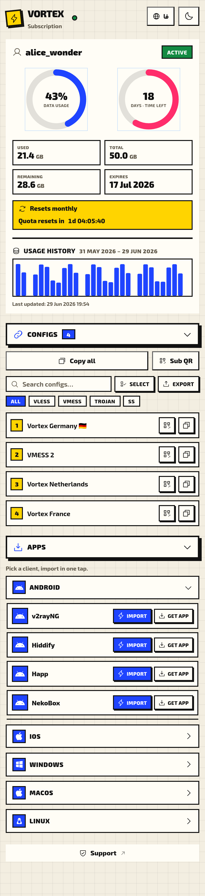
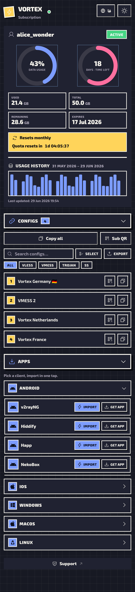

# 🌀 Vortex

A bold **Neo-Brutalist** subscription page template for the [Rebecca](https://github.com/Ho3einK84) panel — the spiritual sibling of [Aurora](https://github.com/Ho3einK84/Aurora), with thick borders, hard offset shadows and chunky type. Everything compiles to **one self-contained `dist/index.html`** with **zero external requests** (CSS, fonts, JS, QR and the app catalogue all inlined), built with **UnoCSS** + **vanilla JS**, in **English / فارسی** with full RTL.

📋 See [CHANGELOG.md](./CHANGELOG.md) for the full version history.

---

## ✨ Features

- 💳 **Service card** — dual rings (data + time), traffic stats, expiry, live quota-reset countdown; handles unlimited & never-expire.
- 🔗 **Configs** — collapsible list with copy, per-config QR, copy-all, search/filter, `.txt` export and bulk select.
- 📱 **Apps** — OS-grouped client list (Android / iOS / Windows / macOS / Linux) with one-tap import + download links from `src/apps.json`.
- 🎭 **Themes** — `vortex-light` (paper) and `vortex-dark` (amoled); preference persists.
- 🌍 **i18n** — EN (Exo 2) and فارسی (Arad) with full RTL, Persian digits and Jalali dates; force via `?lang=fa` / `?theme=vortex-dark`.
- 🏷️ **White-label** — `brand_name` binding customizes splash, header and title.
- 📊 **Usage dashboard** — 30-day bar chart from `usage_url` with 50/80/90% alerts.
- 📲 **PWA-ready** — dynamically registered manifest + inline service worker.
- ♿ **Accessible** — ARIA labels, QR-modal focus trap, `Ctrl/Cmd+Shift+C` to copy all.
- 🛟 **Resilient** — offline banner and graceful expired / limited / disabled / on-hold / empty states.

---

## 📸 Demo

<p align="center">
  
  
</p>

---

## 🚀 Installation on Rebecca

In Rebecca, go to **Master Settings → Subscriptions**. The template loads from `{Custom templates directory}/{Subscription page template}`, defaulting to `/var/lib/rebecca/templates/subscription/index.html`. Grab the latest release:

```bash
wget -O /var/lib/rebecca/templates/subscription/index.html \
  https://github.com/Ho3einK84/Vortex/releases/latest/download/index.html
```

Make sure **Subscription page template** is `subscription/index.html` (the default), or paste the file into the **Template Creator** tab. Rebecca reloads the template per request — no restart needed, just open any user's subscription URL.

## 🔄 Updating

Re-run the same `wget` command (or re-paste into **Template Creator**) — the new file is picked up on the next page load.

## 🛠️ Building locally

```bash
npm ci
npm run build      # → dist/index.html (single self-contained file)
```

---

## 🔒 How it stays pongo2-safe

Rebecca renders the page through **pongo2** at request time. Vortex keeps every template directive (`{{ }}`, ``, `{# #}`) inside a single hidden **data-island** (`#rb-data`); the inlined JS — which legitimately contains `{{` / `${…}` — is **base64-encoded and injected at runtime** so pongo2 never parses it (avoiding the dreaded HTTP 502). A build-time **directive guard** fails if any inlined asset adds a stray directive, the data-island holds anything but the known bindings, or any external resource is referenced.

### Rebecca template context

The data-island binds to:

```
user.username, user.status, user.status_class
user.data_limit (int64 bytes / falsy ⇒ unlimited)
user.data_limit_reset_strategy (no_reset · day · week · month · year)
user.used_traffic (int64 bytes)
user.expire (int64 unix / falsy ⇒ never expires)
links ([]string raw config URIs)
user.subscription_url
usage_url, support_url, token
remaining_days (int64, precomputed — no server-side now())
```

If `subscription_url` isn't absolute, it's derived from `location.origin + location.pathname`. All `now()`-based logic (countdowns, ring depletion) runs **client-side**.

---

## 🎨 Customization

| What | Where |
| --- | --- |
| Brutalist tokens (`brutal`, `brutal-btn`, `brutal-cta`, …) | `uno.config.js` |
| Theme colours / component styles | `src/base.css` (`[data-theme='vortex-light' / 'vortex-dark']`) |
| Client app list + import deep links | `src/apps.json` |
| Translations / Persian digits | `src/i18n.js` |
| Inline SVG icons | `src/icons.js` |
| Markup + data-island bindings | `src/index.html` |

`apps.json` import URLs support these placeholders, substituted at runtime:
`{url}` (raw), `{url_enc}` (`encodeURIComponent`), `{url_b64}` (base64), `{name}` (username).

To swap fonts, replace the `*.woff2` files in `assets/fonts/` (Exo 2 latin / latin-ext subsets and the five Arad weights) — the build base64-inlines whatever is there.

---

## 🗂️ Project structure

```
vortex/
├── src/
│   ├── index.html        # template + Rebecca data-island bindings
│   ├── app.js            # state, i18n, themes, rings, countdown, configs, apps
│   ├── base.css          # theme tokens + brutalist component styles
│   ├── i18n.js           # EN / FA dictionaries + Persian digits
│   ├── qr.js             # qrcode-generator SVG wrapper
│   ├── icons.js          # inline SVG set
│   └── apps.json         # OS-grouped client catalogue
├── assets/fonts/         # Arad (FA) + Exo 2 (EN) woff2
├── uno.config.js         # brutalist shortcuts + theme rules
├── scripts/
│   ├── build.mjs         # compile Uno → inline everything → dist/index.html + guard
│   └── serve.mjs         # local preview with sample pongo2 data (dev only)
├── .github/workflows/build.yml
└── dist/index.html       # build output (committed)
```

---

## 📄 License

MIT.
